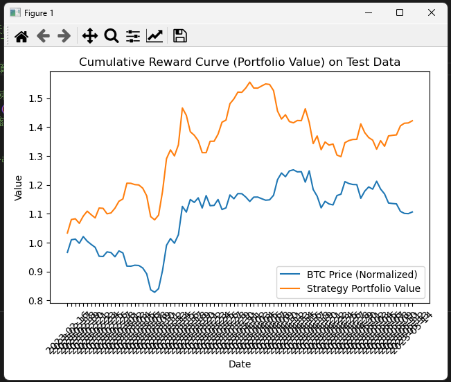

The price of BTC goes up and the profit increases, and when the price falls, the profit also decreases. It seems that simply buying and holding would suffice, and the current strategy doesn't seem to make much of a difference.  
  
The prices of stocks, BTC, and other time-series data are often **influenced by various policies**, so they **contain a lot of noise**. Using them directly for training models may not yield good results. We need to find ways to **extract good features**.