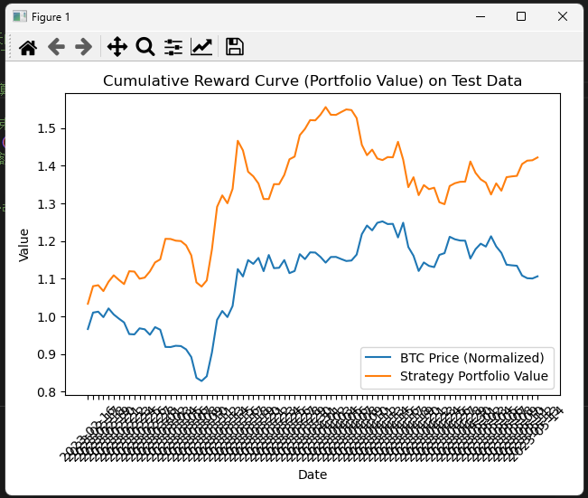

The price of BTC goes up and the profit increases, and when the price falls, the profit also decreases. It seems that simply buying and holding would suffice, and the current strategy doesn't seem to make much of a difference.  
