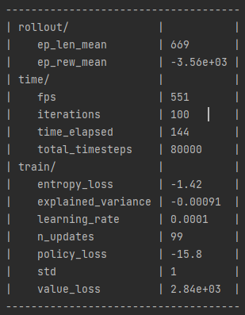
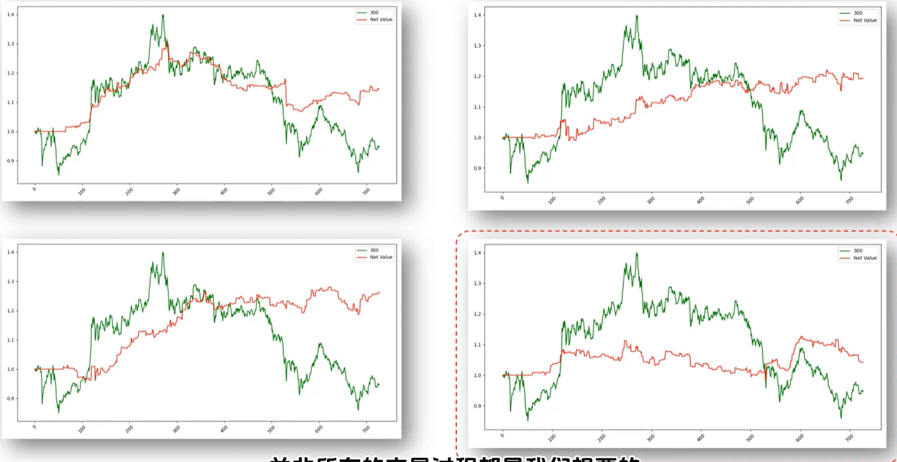
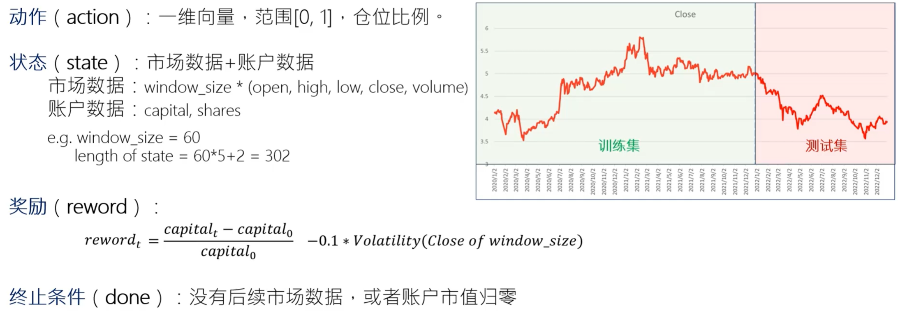

  
**ep_rew mean**: accumulated reward from each episode, so large  
**entropy_loss**: indicating that the probability distribution of actions is relatively even and the uncertainty is high. The closer it is to 0, the more stable it is  
**Explained variance**: It measures the accuracy of value prediction. The closer it is to 1, the better. Now that it is close to 0, it indicates that the prediction ability is relatively low.  
**Policy loss**: Gradient ascent should normally be positive, but here it is negative.  
**Value loss**: It is very large, which may indicate that there is a numerical overflow.  

The performance of this model is not good enough and is also unstable.;

**insufficient data**: The data volume is not sufficient; at least 100,000 data points are needed.  
**data granularity**: The granularity of daily frequency data is too coarse. More detailed data, such as minute-level or order flow data, is required.  
**State design**: The market conditions and account data are simply concatenated without any processing.  
**Reward**: There is room for further optimization(**most important factor in reinforcement learning**).  
**Hyperparameter tuning**: Comparative analysis is necessary.    

**Decomposition of Reinforcement Learning Elements**
