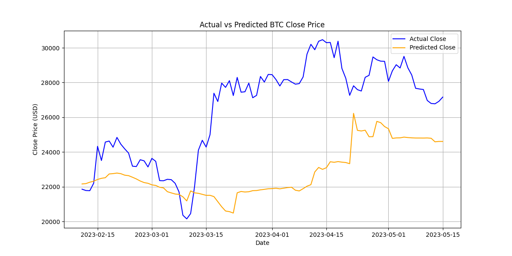

transformer performance is not good enought, need to improve  
reason:  
**insufficient data**: The data volume is not sufficient; at least 100,000 data points are needed.  
**data granularity**: The granularity of daily frequency data is too coarse. More detailed data, such as minute-level or order flow data, is required.  
**State design**: The market conditions and account data are simply concatenated without any processing.  
**Reward**: There is room for further optimization(**most important factor in reinforcement learning**).  
**Hyperparameter tuning**: Comparative analysis is necessary.    

=== Analyzing Factor Importance ===

Factor Importance (Gradient-based):  
volume: 0.0212  
high: 0.0190  
close: 0.0185  
open: 0.0102  
low: 0.0100  

Factor Importance (Permutation Importance):  
open: 0.0137  
volume: -0.0033  
high: -0.0146  
low: -0.0207  
close: -0.0351  

Factor Importance (Feature Ablation):  
open: 0.0214  
low: -0.0210  
high: -0.0360  
volume: -0.0579  
close: -0.0645  