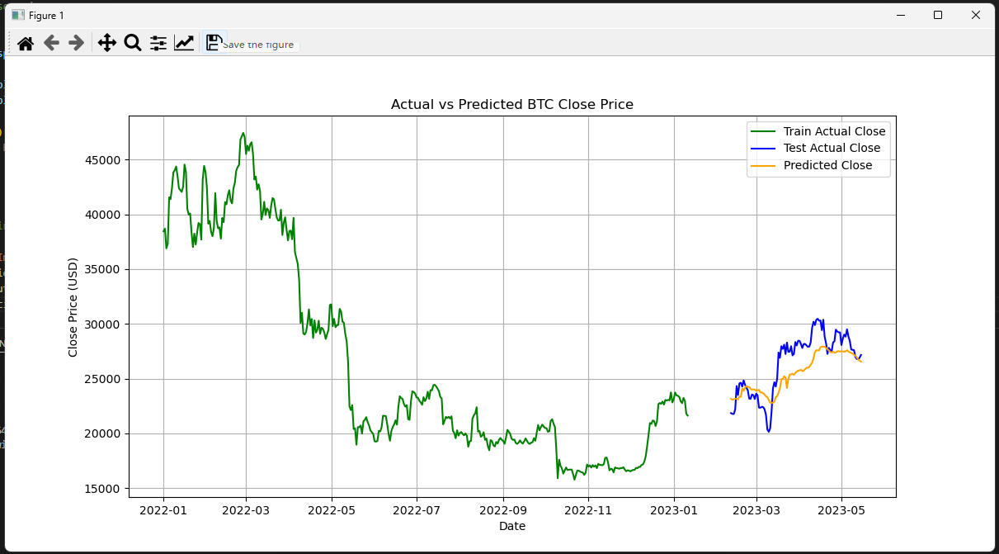
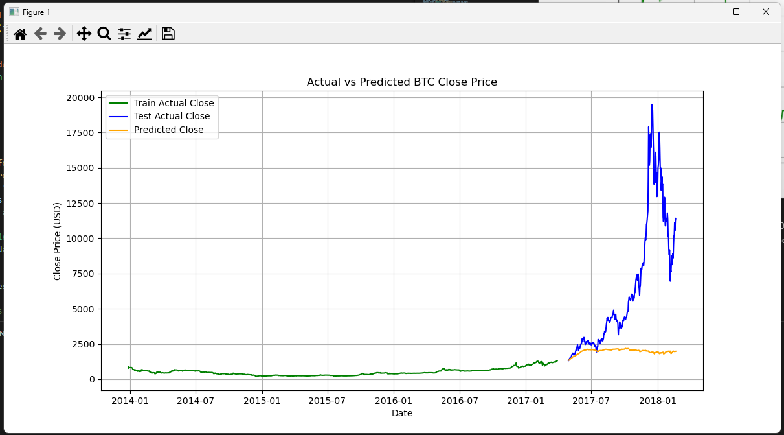
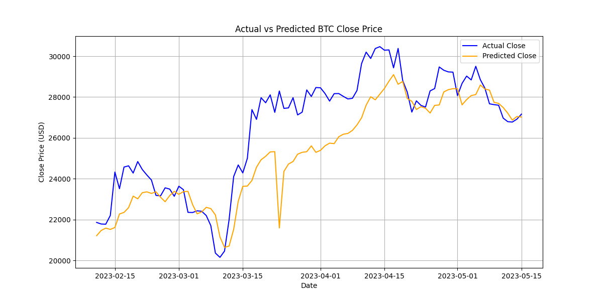

transformer performance is not good enough, need to improve  
**reason**:  
**insufficient data**: The data volume is not sufficient; at least 100,000 data points are needed.  
**data granularity**: The granularity of daily frequency data is too coarse. More detailed data, such as minute-level or order flow data, is required.  
**Hyperparameter tuning**: Comparative analysis is necessary.    

=== Analyzing Factor Importance ===

Factor Importance (Gradient-based):  
volume: 0.0212  
high: 0.0190  
close: 0.0185  
open: 0.0102  
low: 0.0100  

Factor Importance (Permutation Importance):  
open: 0.0137  
volume: -0.0033  
high: -0.0146  
low: -0.0207  
close: -0.0351  

Factor Importance (Feature Ablation):  
open: 0.0214  
low: -0.0210  
high: -0.0360  
volume: -0.0579  
close: -0.0645  

=================2025.6.24 22:50===============  
chang to another dataset lead to a totally different result:  
  
predicted close absolutely useless!  
loss is small, but performance is bad!  
Epoch 1/50, Loss: 0.2788  
Epoch 2/50, Loss: 0.0044  
Epoch 3/50, Loss: 0.0008  
Epoch 4/50, Loss: 0.0006  
Epoch 5/50, Loss: 0.0006  
Epoch 6/50, Loss: 0.0007  
...........  
Epoch 46/50, Loss: 0.0004  
Epoch 47/50, Loss: 0.0005  
Epoch 48/50, Loss: 0.0004  
Epoch 49/50, Loss: 0.0004  
Epoch 50/50, Loss: 0.0004  

One of the most important reasons:  
  **is that the training data is relatively stable, but the test dataset is quite different (the closing price has increased by more than ten times:from 1200 to 20000) from the train data(relatively stable:from 750 to 1200，that's why on test data, the predicted close price is also very stable). The model has not learned the price patterns from the training data, or in other words, the training data has over fitted.**    
  
  ### **Bitcoin's 2017 Boom & 2018 Crash**  
- **Surge to ~$20K**: Driven by retail FOMO, Japanese legalization, and CME futures launch.  
- **Key factors**: Institutional interest (e.g., Grayscale), ICO mania, post-China-ban rebound, and reduced supply post-2016 halving.  
- **Crash in 2018**: Bubble burst, global regulatory crackdowns (China/S. Korea), and exchange hacks led to a drop below $3K.  
- **Legacy**: A hype cycle highlighting crypto's volatility and speculative nature.  

=== Analyzing Factor Importance ===  

Factor Importance (Gradient-based):  
open: 0.0008   
low: 0.0007  
volume: 0.0005  
high: 0.0005  
close: 0.0004  

Factor Importance (Permutation Importance):  
close: 0.0003  
open: -0.0002  
low: -0.0007  
high: -0.0011  
volume: -0.0012  

Factor Importance (Feature Ablation):  
close: 0.0541  
volume: -0.0152  
high: -0.0385  
low: -0.0622  
open: -0.0734  

=================2025.6.25 14:30===============   
change transformer architecture, predict is better,but the **model's predicted closing price is still a step behind**.
    
=== Analyzing Factor Importance ===  
Factor Importance (Gradient-based):  
close: 0.0166  
low: 0.0101  
volume: 0.0050  
open: 0.0036  
high: 0.0030  
Factor Importance (Permutation Importance):  
close: 0.0086  
low: 0.0018  
high: 0.0009  
open: 0.0006  
volume: -0.0008  
Factor Importance (Feature Ablation):  
close: 0.0175    
low: 0.0060  
open: 0.0021  
high: -0.0008  
volume: -0.0136  

 **总结： **  
  训练数据较为平稳，但测试数据波动非常大，导致预测效果非常差(noise太大，直接作为时序预测不合适)；股票预测还能用基本面做因子，加密货币纯粹靠各国政府的政策和市场的情绪、共识等，下一步需要开发爬虫事实爬取数据，然后分析政策、情绪和共识  
  The training data is relatively stable, but the test data fluctuates significantly, resulting in very poor prediction outcomes. In stock forecasting, fundamental factors can be used as indicators, but for cryptocurrencies, it is purely based on government policies in various countries and market sentiment and consensus. The next step is to develop web crawlers to collect real-time data and then analyze policies, sentiment, and consensus.