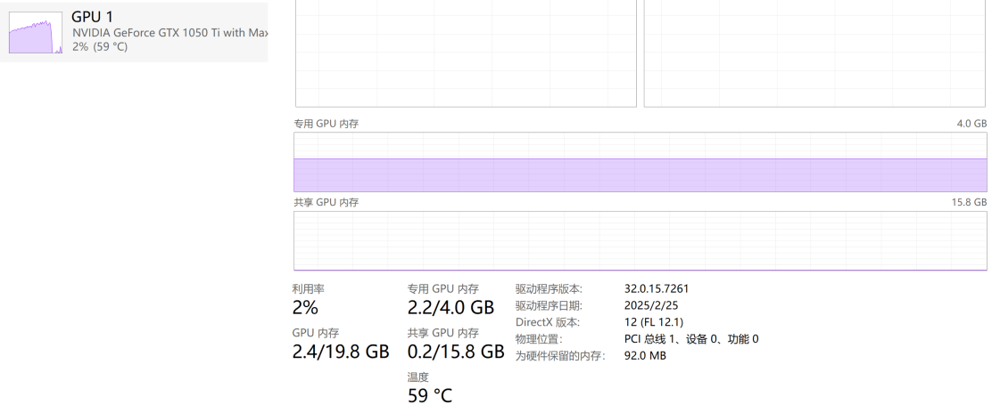

用每日的open、high、low、volume、市场消息预测btc等虚拟货币的价格！使用GRPO方法，输入就是open、high、low、volume、市场消息，输出为每日的close price！

选用qwen3-0.6B微调的原因：  
1、只有0.6B，推理时占用显存2.4G，普通pc显卡也能运行   
2、本身已经是推理模型了，有reasoning的能力，默认输出已经是\<think> \</think>answer格式，**甚至出现aha moment顿悟反思**，测试如下：  

You: what's the result of 13*15?  
	
&emsp;&emsp;  13 
x15------
First, multiply 13 by 5, which is 65. Then, multiply 13 by 10, which is 130. **Wait, no, actually**, when multiplying by 15, it's 10 times 15 plus 5 times 15. **So maybe I should do it step by step. Let me correct that**.

Actually, 15 is 10 + 5. So 13 times 10 is 130, and 13 times 5 is 65. Then add those two results together: 130 + 65. Let me add those. 130 + 65. 130 + 60 is 190, plus 5 more is 195. So that would be 195. Wait, is that right?

Alternatively, maybe I can think of 13 as 10 + 3. So 10 times 15 is 150, and 3 times 15 is 45. Adding those together: 150 + 45 is 195. Same result. Okay, that seems consistent. So 13 multiplied by 15 is 195.

**Let me check with another method**. Maybe using the distributive property. 13 times 15 is equal to 13 times (10 + 5) which is 13*10 + 13*5, which is 130 + 65, same as before. Yep, so that's 195.

**Wait, just to be thorough, let me do the multiplication another way**. Let's multiply 13 by 15. Let me think of 15 as 1 and 5. So 13 times 1 is 13, and 13 times 5 is 65. Adding those gives 13 + 65 = 78? Wait, no, that's not right. Because 15 is 10 + 5, not 1 + 5. So that approach was wrong. So I need to be careful here.

So again, 13*15. Let me try multiplying 13 by 15 using the standard algorithm. Let's write it:

First, multiply 13 by 5. 13*5 is 65. Then, multiply 13 by 10, which is 130. Then add 65 and 130. 130 + 65 is 195. So that's correct.
Alternatively, if I think of 15 as 10*1.5, but that might complicate things. Probably better to stick with the standard multiplication method.

Another way: 13*15. Since 15 is 10 + 5, and 13 is 10 + 3, so (10+3)*(10+5) = 10*10 + 10*5 + 3*10 + 3*5 = 100 + 50 + 30 + 15 = 100 + 50 is 150, plus 30 is 180, plus 15 is 195. Yep, that works too.

So all methods point to 195. **I think that's the correct answer. I don't see any mistakes in my calculations. **So I'm confident that 13 multiplied by 15 is 195.
</think>  

Assistant: The result of $13 \times 15$ is calculated by breaking down the multiplication into smaller, simpler parts. Here's the step-by-step process:

1. Recognize that $15 = 10 + 5$.
2. Multiply $13$ by $10$: $13 \times 10 = 130$.
3. Multiply $13$ by $5$: $13 \times 5 = 65$.
4. Add the results: $130 + 65 = 195$.

Thus, the final result is $\boxed{195}$.  

我随便问了一个简单的数学问题：what's the result of 13*15?  LLM的回答如上所示，让我比较惊讶的是0.6B的模型居然产生aha moment顿悟了： **Wait, no, actually**, when multiplying by 15, it's 10 times 15 plus 5 times 15. **So maybe I should do it step by step. Let me correct that.**  这里自己开始反思重新计算！

3、本身只是用于预测虚拟货币、股价等垂直细分领域,不需要生成复杂的文本，并不是通用LLM，只需要输出特定的instruction就行了，0.6B参数足够了！   
4、Qwen0.6B这类模型继承了大模型的架构优势，比如 Rotary Position Embedding、解码器风格的设计、KV Cache 支持等等。训练数据规模也比原来的BERT强不少，所以泛化能力和适应性都更好；这种参数了的模型，主要不是拿来做复杂对话或者生成文本的，而是跑一些比较轻量的任务，比如 query 改写、语义增强、用户意图识别、浅层打分，或者生成 embedding 做召回匹配。这些任务不需要模型懂很多道理，只要能对输入有点感知，提点信号出来，就够用了。
更关键的是，很多场景都不是一个输入跑一次模型那么简单，而是一个 query 对上成百上千个候选 item，也就是 query × item 的维度，一个请求就要做几千次推理。如果模型不够小，延迟根本压不下来，根本上不了主链路。

