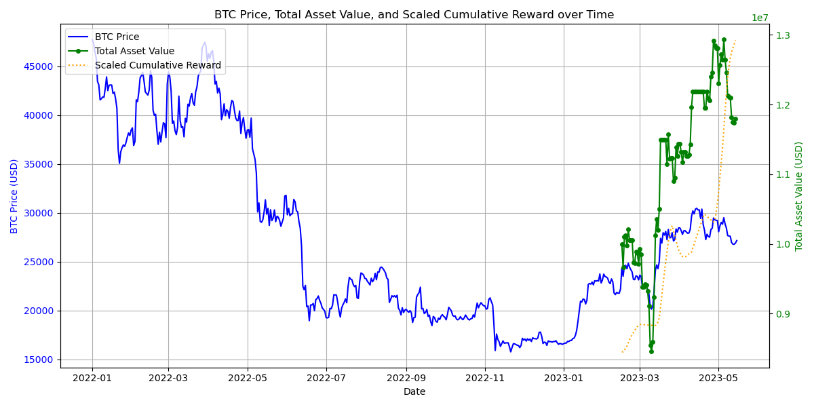

transformer + ppo to train a model, trading btc!  
   
max Drawdown：17%  
| steps | rewards      | prices   | actions | balance            | holding            | total_asset_value  | datetime  | max_drawdown        | peak_idx | trough_idx |
|-------|--------------|----------|---------|--------------------|--------------------|--------------------|-----------|---------------------|----------|------------|
| 1     | -0.1         | 24327.98 | 1       | 0                  | 411.04933496328096 | 10000000           | 2023/2/15 | 0.17138083816700628 | 79       | 23         |
| 2     | -0.06        | 23511.81 | 1       | 0                  | 411.04933496328096 | 9664513.86428302   | 2023/2/16 | 0.17138083816700628 | 79       | 23         |
| 3     | 0.29623836   | 24573.38 | 0       | 0                  | 411.04933496328096 | 10100871.50679999  | 2023/2/17 | 0.17138083816700628 | 79       | 23         |
| 4     | 0.53475094   | 24632.15 | 0       | 0                  | 411.04933496328096 | 10125028.876215782 | 2023/2/18 | 0.17138083816700628 | 79       | 23         |
| 5     | 0.38690957   | 24278.24 | 0       | 0                  | 411.04933496328096 | 9979554.406078927  | 2023/2/19 | 0.17138083816700628 | 79       | 23         |
| 6     | 0.67435825   | 24841.69 | 0       | 0                  | 411.04933496328096 | 10211160.153863987 | 2023/2/20 | 0.17138083816700628 | 79       | 23         |
| 7     | 0.63655007   | 24451.98 | 2       | 10050970.117535446 | 0                  | 10050970.117535446 | 2023/2/21 | 0.17138083816700628 | 79       | 23         |
| 8     | 0.5544813    | 24182.92 | 2       | 10050970.117535446 | 0                  | 10050970.117535446 | 2023/2/22 | 0.17138083816700628 | 79       | 23         |
| 9     | 0.4817612    | 23937.74 | 1       | 0                  | 419.87965938035273 | 10050970.117535446 | 2023/2/23 | 0.17138083816700628 | 79       | 23         |
| 10    | 0.43158507   | 23184.48 | 1       | 0                  | 419.87965938035273 | 9734691.5653106    | 2023/2/24 | 0.17138083816700628 | 79       | 23         |
| 11    | 0.43958506   | 23164.25 | 1       | 0                  | 419.87965938035273 | 9726197.399801336  | 2023/2/25 | 0.17138083816700628 | 79       | 23         |
| 12    | 0.43958506   | 23555.9  | 1       | 0                  | 419.87965938035273 | 9890643.268397652  | 2023/2/26 | 0.17138083816700628 | 79       | 23         |
| 13    | 0.33671355   | 23492.78 | 1       | 0                  | 419.87965938035273 | 9864140.464297563  | 2023/2/27 | 0.17138083816700628 | 79       | 23         |
| 14    | 0.20968468   | 23141.46 | 1       | 0                  | 419.87965938035273 | 9716628.342364058  | 2023/2/28 | 0.17138083816700628 | 79       | 23         |
| 15    | 0.22813027   | 23633.88 | 1       | 0                  | 419.87965938035273 | 9923385.48423613   | 2023/3/1  | 0.17138083816700628 | 79       | 23         |
| 16    | 0.014970117  | 23464.98 | 1       | 0                  | 419.87965938035273 | 9852467.80976679   | 2023/3/2  | 0.17138083816700628 | 79       | 23         |
| 17    | -0.028       | 22354.37 | 1       | 0                  | 419.87965938035273 | 9386145.261262376  | 2023/3/3  | 0.17138083816700628 | 79       | 23         |
| 18    | -0.028       | 22346.7  | 1       | 0                  | 419.87965938035273 | 9382924.784274928  | 2023/3/4  | 0.17138083816700628 | 79       | 23         |
| 19    | -0.02        | 22429.42 | 1       | 0                  | 419.87965938035273 | 9417657.22969887   | 2023/3/5  | 0.17138083816700628 | 79       | 23         |
| 20    | -0.02        | 22408.85 | 1       | 0                  | 419.87965938035273 | 9409020.305105416  | 2023/3/6  | 0.17138083816700628 | 79       | 23         |
| 21    | -0.02        | 22198.4  | 1       | 0                  | 419.87965938035273 | 9320656.630788824  | 2023/3/7  | 0.17138083816700628 | 79       | 23         |
| 22    | -0.02        | 21704.03 | 1       | 0                  | 419.87965938035273 | 9113080.723580956  | 2023/3/8  | 0.17138083816700628 | 79       | 23         |
| 23    | -0.02        | 20361.01 | 1       | 0                  | 419.87965938035273 | 8549173.943439955  | 2023/3/9  | 0.17138083816700628 | 79       | 23         |
| 24    | -0.02        | 20151.4  | 1       | 0                  | 419.87965938035273 | 8461162.96803724   | 2023/3/10 | 0.17138083816700628 | 79       | 23         |
| 25    | -0.02        | 20458.41 | 1       | 0                  | 419.87965938035273 | 8590070.222263603  | 2023/3/11 | 0.17138083816700628 | 79       | 23         |
| 26    | -0.02        | 21995.43 | 1       | 0                  | 419.87965938035273 | 9235433.656324392  | 2023/3/12 | 0.17138083816700628 | 79       | 23         |
| 27    | -0.02        | 24107.64 | 1       | 0                  | 419.87965938035273 | 10122307.671664167 | 2023/3/13 | 0.17138083816700628 | 79       | 23         |
| 28    | 0.28989455   | 24674.77 | 0       | 0                  | 419.87965938035273 | 10360434.022888547 | 2023/3/14 | 0.17138083816700628 | 79       | 23         |
| 29    | 0.43684977   | 24284.73 | 0       | 0                  | 419.87965938035273 | 10196664.160543833 | 2023/3/15 | 0.17138083816700628 | 79       | 23         |
| 30    | 0.8834448    | 25002    | 0       | 0                  | 419.87965938035273 | 10497831.24382758  | 2023/3/16 | 0.17138083816700628 | 79       | 23         |
| 31    | 2.315447     | 27384.78 | 2       | 11498312.098605895 | 0                  | 11498312.098605895 | 2023/3/17 | 0.17138083816700628 | 79       | 23         |
| 32    | 2.317447     | 26907.5  | 0       | 11498312.098605895 | 0                  | 11498312.098605895 | 2023/3/18 | 0.17138083816700628 | 79       | 23         |
| 33    | 2.317447     | 27966.67 | 2       | 11498312.098605895 | 0                  | 11498312.098605895 | 2023/3/19 | 0.17138083816700628 | 79       | 23         |
| 34    | 2.319447     | 27721.39 | 0       | 11498312.098605895 | 0                  | 11498312.098605895 | 2023/3/20 | 0.17138083816700628 | 79       | 23         |
| 35    | 2.3114471    | 28107.3  | 1       | 0                  | 409.0863262784364  | 11498312.098605895 | 2023/3/21 | 0.17138083816700628 | 79       | 23         |
| 36    | 2.008811     | 27251.05 | 0       | 0                  | 409.0863262784364  | 11148031.931729984 | 2023/3/22 | 0.17138083816700628 | 79       | 23         |
| 37    | 2.0776832    | 28295.26 | 0       | 0                  | 409.0863262784364  | 11575203.964493189 | 2023/3/23 | 0.17138083816700628 | 79       | 23         |
| 38    | 1.5340492    | 27444.7  | 0       | 0                  | 409.0863262784364  | 11227251.498813804 | 2023/3/24 | 0.17138083816700628 | 79       | 23         |
| 39    | 1.1518327    | 27468.53 | 2       | 11237000.025969017 | 0                  | 11237000.025969017 | 2023/3/25 | 0.17138083816700628 | 79       | 23         |
| 40    | 0.69723773   | 27968.15 | 1       | 0                  | 401.7784524885992  | 11237000.025969017 | 2023/3/26 | 0.17138083816700628 | 79       | 23         |
| 41    | -1.0345399   | 27124.14 | 0       | 0                  | 401.7784524885992  | 10897894.994284114 | 2023/3/27 | 0.17138083816700628 | 79       | 23         |
| 42    | -1.03654     | 27260.96 | 1       | 0                  | 401.7784524885992  | 10952866.322153604 | 2023/3/28 | 0.17138083816700628 | 79       | 23         |
| 43    | -1.03654     | 28348.58 | 1       | 0                  | 401.7784524885992  | 11389848.602649255 | 2023/3/29 | 0.17138083816700628 | 79       | 23         |
| 44    | -1.03854     | 28028.54 | 1       | 0                  | 401.7784524885992  | 11261263.426714802 | 2023/3/30 | 0.17138083816700628 | 79       | 23         |
| 45    | -0.85064834  | 28465.68 | 0       | 0                  | 401.7784524885992  | 11436896.859435668 | 2023/3/31 | 0.17138083816700628 | 79       | 23         |
| 46    | -0.5480122   | 28453.34 | 1       | 0                  | 401.7784524885992  | 11431938.91333196  | 2023/4/1  | 0.17138083816700628 | 79       | 23         |
| 47    | -0.5422018   | 28171.43 | 0       | 0                  | 401.7784524885992  | 11318673.549790898 | 2023/4/2  | 0.17138083816700628 | 79       | 23         |
| 48    | -0.30846235  | 27801.61 | 1       | 0                  | 401.7784524885992  | 11170087.842491565 | 2023/4/3  | 0.17138083816700628 | 79       | 23         |
| 49    | -0.0732011   | 28165.77 | 1       | 0                  | 401.7784524885992  | 11316399.483749812 | 2023/4/4  | 0.17138083816700628 | 79       | 23         |
| 50    | -0.065201096 | 28171.89 | 1       | 0                  | 401.7784524885992  | 11318858.367879042 | 2023/4/5  | 0.17138083816700628 | 79       | 23         |
| 51    | 0.25015828   | 28034.11 | 2       | 11263501.332695164 | 0                  | 11263501.332695164 | 2023/4/6  | 0.17138083816700628 | 79       | 23         |
| 52    | 0.24215828   | 27906.45 | 1       | 0                  | 403.6164160147623  | 11263501.332695164 | 2023/4/7  | 0.17138083816700628 | 79       | 23         |
| 53    | 0.24215828   | 27938.47 | 1       | 0                  | 403.6164160147623  | 11276425.130335957 | 2023/4/8  | 0.17138083816700628 | 79       | 23         |
| 54    | 0.24215828   | 28322.81 | 1       | 0                  | 403.6164160147623  | 11431551.06366707  | 2023/4/9  | 0.17138083816700628 | 79       | 23         |
| 55    | 0.062266648  | 29637.2  | 1       | 0                  | 403.6164160147623  | 11962060.444712713 | 2023/4/10 | 0.17138083816700628 | 79       | 23         |
| 56    | 0.8761053    | 30199.91 | 2       | 12189179.43816838  | 0                  | 12189179.43816838  | 2023/4/11 | 0.17138083816700628 | 79       | 23         |
| 57    | 0.80342263   | 29888.27 | 0       | 12189179.43816838  | 0                  | 12189179.43816838  | 2023/4/12 | 0.17138083816700628 | 79       | 23         |
| 58    | 0.80542266   | 30375.59 | 0       | 12189179.43816838  | 0                  | 12189179.43816838  | 2023/4/13 | 0.17138083816700628 | 79       | 23         |
| 59    | 0.80742264   | 30466.97 | 0       | 12189179.43816838  | 0                  | 12189179.43816838  | 2023/4/14 | 0.17138083816700628 | 79       | 23         |
| 60    | 0.80742264   | 30295.01 | 2       | 12189179.43816838  | 0                  | 12189179.43816838  | 2023/4/15 | 0.17138083816700628 | 79       | 23         |
| 61    | 0.7918387    | 30307.29 | 2       | 12189179.43816838  | 0                  | 12189179.43816838  | 2023/4/16 | 0.17138083816700628 | 79       | 23         |
| 62    | 0.79983866   | 29429.92 | 2       | 12189179.43816838  | 0                  | 12189179.43816838  | 2023/4/17 | 0.17138083816700628 | 79       | 23         |
| 63    | 0.79983866   | 30380.16 | 2       | 12189179.43816838  | 0                  | 12189179.43816838  | 2023/4/18 | 0.17138083816700628 | 79       | 23         |
| 64    | 0.7918387    | 28809.79 | 1       | 0                  | 423.09157540434626 | 12189179.43816838  | 2023/4/19 | 0.17138083816700628 | 79       | 23         |
| 65    | 0.58742976   | 28243.94 | 2       | 11949773.070225831 | 0                  | 11949773.070225831 | 2023/4/20 | 0.17138083816700628 | 79       | 23         |
| 66    | -0.23440893  | 27262.95 | 1       | 0                  | 438.31548200858055 | 11949773.070225831 | 2023/4/21 | 0.17138083816700628 | 79       | 23         |
| 67    | -0.23640893  | 27812.99 | 1       | 0                  | 438.31548200858055 | 12190864.117949832 | 2023/4/22 | 0.17138083816700628 | 79       | 23         |
| 68    | -0.23840892  | 27590.46 | 1       | 0                  | 438.31548200858055 | 12093325.77373846  | 2023/4/23 | 0.17138083816700628 | 79       | 23         |
| 69    | -0.24040893  | 27511.13 | 1       | 0                  | 438.31548200858055 | 12058554.206550721 | 2023/4/24 | 0.17138083816700628 | 79       | 23         |
| 70    | -0.24040893  | 28300.8  | 1       | 0                  | 438.31548200858055 | 12404678.793228436 | 2023/4/25 | 0.17138083816700628 | 79       | 23         |
| 71    | -0.24040893  | 28415.3  | 1       | 0                  | 438.31548200858055 | 12454865.91591842  | 2023/4/26 | 0.17138083816700628 | 79       | 23         |
| 72    | -0.24040893  | 29472.78 | 1       | 0                  | 438.31548200858055 | 12918375.771832852 | 2023/4/27 | 0.17138083816700628 | 79       | 23         |
| 73    | 0.5130688    | 29311.7  | 0       | 0                  | 438.31548200858055 | 12847771.913990911 | 2023/4/28 | 0.17138083816700628 | 79       | 23         |
| 74    | 1.2447442    | 29230.45 | 0       | 0                  | 438.31548200858055 | 12812158.781077713 | 2023/4/29 | 0.17138083816700628 | 79       | 23         |
| 75    | 2.1687093    | 29219.22 | 0       | 0                  | 438.31548200858055 | 12807236.498214757 | 2023/4/30 | 0.17138083816700628 | 79       | 23         |
| 76    | 2.4740992    | 28068.27 | 0       | 0                  | 438.31548200858055 | 12302757.294196982 | 2023/5/1  | 0.17138083816700628 | 79       | 23         |
| 77    | 2.9921513    | 28669.86 | 0       | 0                  | 438.31548200858055 | 12566443.505018523 | 2023/5/2  | 0.17138083816700628 | 79       | 23         |
| 78    | 2.9921513    | 29026.15 | 1       | 0                  | 438.31548200858055 | 12722610.928103361 | 2023/5/3  | 0.17138083816700628 | 79       | 23         |
| 79    | 2.9921513    | 28838.16 | 1       | 0                  | 438.31548200858055 | 12640212.000640567 | 2023/5/4  | 0.17138083816700628 | 79       | 23         |
| 80    | 3.8168466    | 29505.86 | 0       | 0                  | 438.31548200858055 | 12932875.247977696 | 2023/5/5  | 0.17138083816700628 | 79       | 23         |
| 81    | 3.8168466    | 28848.19 | 1       | 0                  | 438.31548200858055 | 12644608.304925112 | 2023/5/6  | 0.17138083816700628 | 79       | 23         |
| 82    | 3.8168466    | 28434.15 | 1       | 0                  | 438.31548200858055 | 12463128.16275428  | 2023/5/7  | 0.17138083816700628 | 79       | 23         |
| 83    | 3.0633688    | 27668.79 | 1       | 0                  | 438.31548200858055 | 12127659.025444193 | 2023/5/8  | 0.17138083816700628 | 79       | 23         |
| 84    | 2.3396933    | 27628.27 | 1       | 0                  | 438.31548200858055 | 12109898.482113205 | 2023/5/9  | 0.17138083816700628 | 79       | 23         |
| 85    | 1.6201372    | 27598.75 | 1       | 0                  | 438.31548200858055 | 12096959.409084313 | 2023/5/10 | 0.17138083816700628 | 79       | 23         |
| 86    | 1.3227472    | 26968.62 | 1       | 0                  | 438.31548200858055 | 11820763.674406245 | 2023/5/11 | 0.17138083816700628 | 79       | 23         |
| 87    | 0.80469525   | 26795.01 | 1       | 0                  | 438.31548200858055 | 11744667.723574735 | 2023/5/12 | 0.17138083816700628 | 79       | 23         |
| 88    | 0.80469525   | 26775.27 | 1       | 0                  | 438.31548200858055 | 11736015.375959886 | 2023/5/13 | 0.17138083816700628 | 79       | 23         |
| 89    | 0.80469525   | 26917.62 | 1       | 0                  | 438.31548200858055 | 11798409.584823808 | 2023/5/14 | 0.17138083816700628 | 79       | 23         |

理想情况是：第二天上涨时头天买入，第二天下跌时头天卖出，能保持净值一直上涨！但回测时最大回撤高达17%，btc price涨了净值涨，跌了净值跟着跌，说明模型对趋势的预测还不完美；  
btc这种虚拟货币主要依靠各国政府的政策和市场共识影响价格，单存使用open、high、low、close、volume、rsi、sma等技术指标预测并不十分靠谱，更重要的还是要收集虚拟货币的各种新闻消息，判断这些信息对虚拟货币的正负面影响！
下一步的做法：爬虫收集各种信息，用GRPO等方式微调LLM，让LLM根据当前的各种政策、消息、市场参与者的言论、open、high、low、close、volume、rsi、sma等一起共同预测btc price，而不是单存依赖交易的技术指标！

The ideal scenario would be to buy the day before the price goes up and sell the day before it goes down so that the net value keeps rising. However, during backtesting, the maximum drawdown was as high as 17%. When the BTC price went up, the net value rose, and when the BTC price fell, the net value also declined. This indicates that the model's trend prediction is still not perfect.
BTC, as a virtual currency, mainly relies on the policies of various countries and market consensus to influence its price. Relying solely on technical indicators such as open, high, low, close, volume, RSI, and SMA for prediction is not very reliable. It is more important to collect various news about virtual currencies and assess the positive or negative impact of this information on the virtual currency.
The next step is to use web crawlers to collect various pieces of information and fine-tune the LLM with methods like GRPO. This way, the LLM can predict the BTC price based on a combination of current policies, news, market participants' comments, open, high, low, close, volume, RSI, and SMA, instead of relying solely on trading technical indicators.